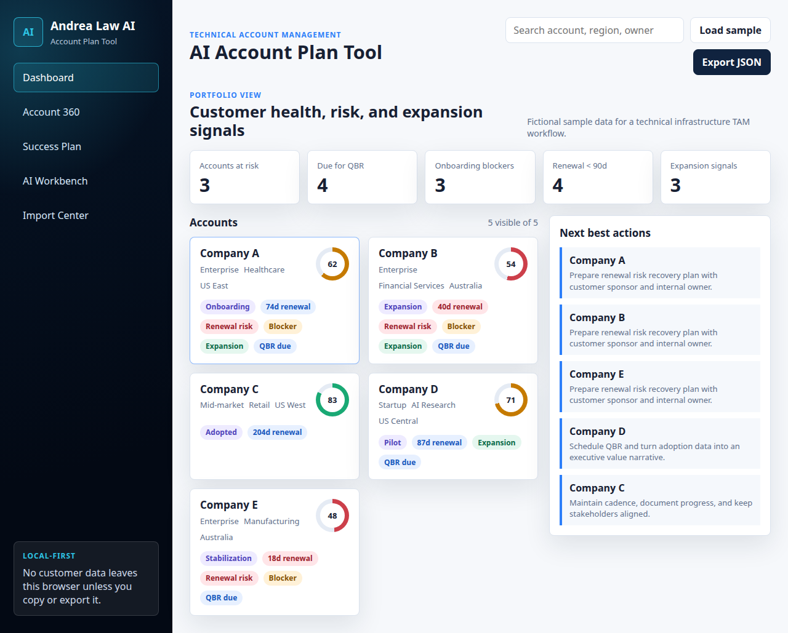

# AI Account Plan Tool for Technical Account Managers

A local-first browser demo for Technical Account Managers who need to turn scattered account data into customer health signals, renewal risk, expansion signals, a success plan, QBR talking points, and grounded AI prompts.

This is a prototype for practical AI-at-work demos. It uses fictional customer data and does not require a paid CRM, customer-success platform, backend, cloud database, or API key.



## Try It

After this folder is merged into the public GitHub Pages repo, open:

```text
https://andrealaw.github.io/practice/ai-account-plan-tool/
```

To run it from a local clone or downloaded ZIP, open:

```text
practice/ai-account-plan-tool/index.html
```

If you are already inside this folder, open:

```text
./index.html
```

The app is static HTML, CSS, and JavaScript. Opening `index.html` directly in Chrome or Edge is enough.

## Download And Run Locally

1. Go to the repository: `https://github.com/andrealaw/andrealaw.github.io`.
2. Select **Code** then **Download ZIP**.
3. Unzip the file.
4. Open `practice/ai-account-plan-tool/index.html` in Chrome or Edge.
5. Select **Load sample** if the fictional demo data is not already visible.

Optional local server:

```bash
cd practice/ai-account-plan-tool
python3 -m http.server 8000
```

Then open:

```text
http://localhost:8000
```

## What It Models

- CRM/account records: account owner, segment, ARR band, renewal date, stage, and health.
- Customer success planning: account health, QBR due signals, renewal risk, and expansion signals.
- Jira/Zendesk-style work: issue severity, status, age, theme, and customer impact.
- Product usage analytics: tenant environments, active users, provisioning time, projects, and AI/GPU workload signals.
- TAM operating rhythm: stakeholder map, next best action, success plan, and QBR talking points.
- Approved-AI workflow: grounded prompts for copy/paste into company-approved AI tools.

## Import Your Own CSVs

Use the Import Center to upload CSV snapshots matching these sample files:

- [`data/accounts.csv`](./data/accounts.csv)
- [`data/stakeholders.csv`](./data/stakeholders.csv)
- [`data/tickets.csv`](./data/tickets.csv)
- [`data/usage.csv`](./data/usage.csv)
- [`data/notes.csv`](./data/notes.csv)

The app stores imported data in browser `localStorage`. Use **Export JSON** for backup or handoff, and **Clear local data** to reset the browser state.

## Privacy Model

The app does not send data to a server. The AI Workbench only generates prompts from local browser data.

For real company use, do not paste confidential account or customer data into consumer AI tools unless your company has approved that workflow. Use approved enterprise AI, an internal LLM, or a local model for sensitive data.

## Demo Flow

1. Open the dashboard and show account health, renewal, QBR, blocker, and expansion signals.
2. Select a risk-heavy account such as **Company B** or **Company E**.
3. Open **Account 360** to review customer objective, stakeholders, usage, and open issues.
4. Open **Success Plan** and export Markdown.
5. Open **AI Workbench**, generate an account-plan or QBR prompt, and copy it into an approved AI tool.
6. Open **Import Center** to show CSV imports, JSON handoff, and team workflow options.

## Files

- `index.html`: app shell
- `styles.css`: visual design
- `app.js`: local data, CSV parsing, risk signals, prompt generation, Markdown export
- `data/*.csv`: fictional sample data and import templates
- `assets/dashboard-preview.png`: README preview image

## Status

Initial public version. This is a workflow prototype, not a production customer-success platform.
